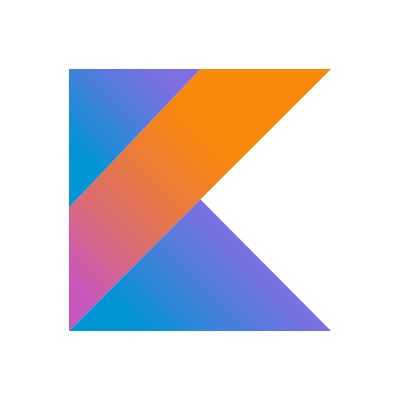

# KoRd 
**KoRd is simple DSL that helps you to create readme files** 
 
 
*What is DSL?* 
>domain-specific language (DSL) is a computer language specialized to a particular application domain. This is in contrast to a general-purpose language (GPL), which is broadly applicable across domains. 

 
*It support all possible tags from GitHub* 
*KoRd can* 
- Paste images
- Quote smth
 
Created at Fri Mar 08 17:20:26 EET 2019